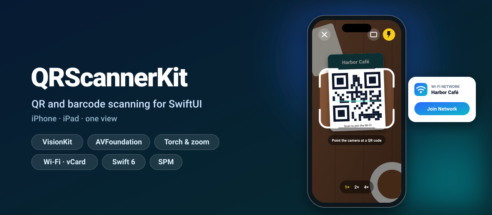
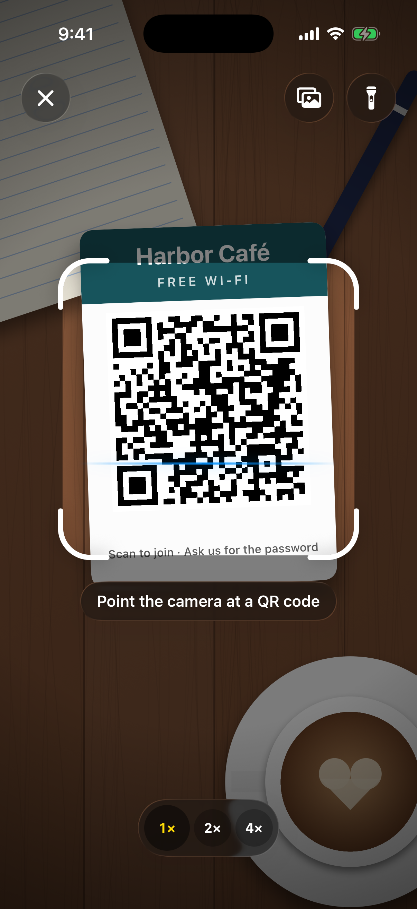
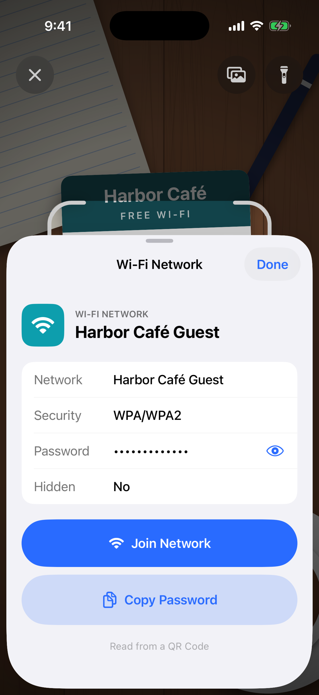
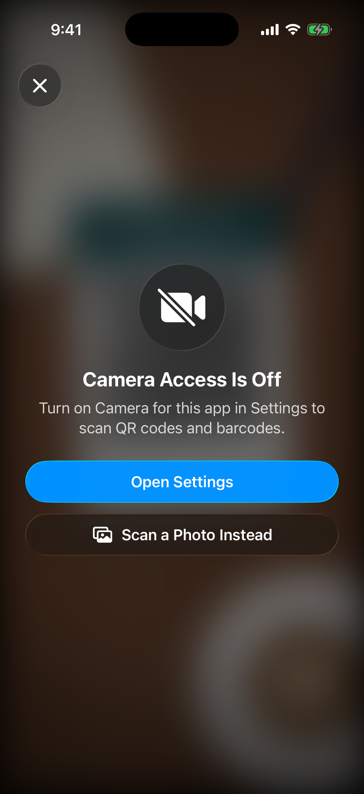
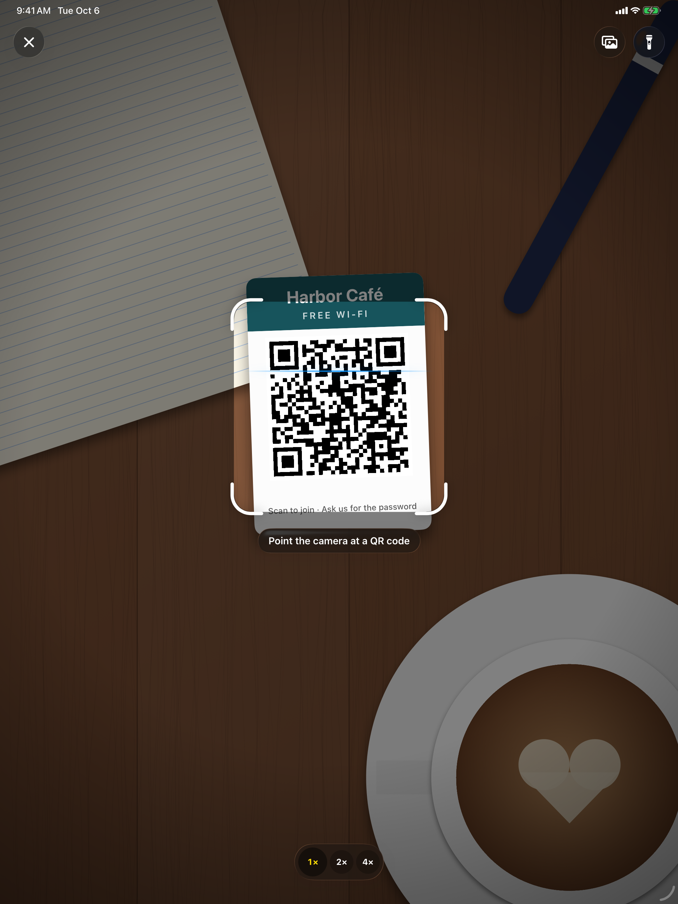

<p align="center">
  
</p>

<p align="center">
  <a href="https://github.com/halilozel1903/QRScannerKit/actions/workflows/ci.yml"></a>
  
  
  
  
  <a href="LICENSE"></a>
</p>

**QRScannerKit** puts a finished QR code and barcode scanner into your SwiftUI app with one view: **VisionKit's `DataScannerViewController`** where the device supports it, an **`AVCaptureMetadataOutput` fallback** everywhere else, a viewfinder with animated corners, **torch, zoom, haptics** and every **camera permission state**. Scanned strings are parsed into **links, Wi-Fi networks, contacts, places, emails, phone numbers and text messages** by tested, pure Swift code, and a preview scanner makes previews, screenshots and the simulator work without a camera.

```swift
@State private var isScanning = false

Button("Scan") { isScanning = true }
    .qrScanner(isPresented: $isScanning) { result in
        if case .wifi(let network) = result.payload { join(network) }
    }
```

## Screenshots

Captured from the example app on iOS 26 simulators by CI. The simulator has no camera, so a drawing of a café table stands in for the camera picture; everything on top of it is the real scanner.

| Scanning | Wi-Fi result | Camera access denied |
| :---: | :---: | :---: |
|  |  |  |

On iPad the viewfinder keeps a sensible size and the controls follow the safe area:

<p align="center">
  
</p>

## Features

- **One view, the right camera path**: `QRScannerView` uses `DataScannerViewController` when `isSupported` and `isAvailable` say so (A12 Bionic and later), and an `AVCaptureSession` with `AVCaptureMetadataOutput` otherwise. Force the fallback with `source: .captureSession`.
- **Viewfinder with a region of interest**: dims the picture outside a rounded window, animates its corners, sweeps a scan line, turns green with a checkmark on success, and only reads codes inside it (VisionKit `regionOfInterest`, `AVCaptureMetadataOutput.rectOfInterest`).
- **Torch, zoom and haptics**: a flashlight button (also while VisionKit runs), 1×/2×/4× zoom buttons and pinch to zoom, and a success haptic through `sensoryFeedback`.
- **Every permission state**: asks for access, explains a denied camera with an **Open Settings** button, a restricted camera (Screen Time, MDM) and devices without a camera, and rechecks when the app becomes active again.
- **Scan from photos**: a photo button in the scanner, `PhotoScanButton` for your own screens and `ImageScanner` for any image, all on Vision's `VNDetectBarcodesRequest`.
- **Payload parsing**: `ScanPayload` understands URLs, `WIFI:` (any field order, backslash escapes, quoted SSIDs, WPA/WPA3/WEP/open, hidden), vCard 2.1–4.0 and MECARD, `geo:`, `mailto:` and `MATMSG:`, `tel:`, `sms:` and `SMSTO:`, and falls back to text. `actionURL` opens the result in Mail, Phone, Messages or Maps.
- **Duplicate suppression**: the same code is delivered once, then ignored for `duplicateInterval` seconds (2 by default) by a tested `DuplicateFilter`.
- **16 symbologies**: QR, Micro QR, Aztec, Data Matrix, PDF417, MicroPDF417, Code 39/93/128, EAN-8, EAN-13, UPC-E, ITF-14, Interleaved 2 of 5, Codabar and GS1 DataBar, mapped to Vision and AVFoundation for you.
- **Preview scanner**: `PreviewScanner` shows a still image instead of the camera, fakes permission states and can "find" codes on a timer, for previews, UI tests, screenshots and the simulator.
- **Liquid Glass** buttons on iOS 26, materials on iOS 17. **Swift 6 strict concurrency**, zero dependencies, tested with Swift Testing.

## Installation

In Xcode choose **File › Add Package Dependencies…** and enter:

```
https://github.com/halilozel1903/QRScannerKit
```

Or add it to `Package.swift`:

```swift
dependencies: [
    .package(url: "https://github.com/halilozel1903/QRScannerKit", from: "1.0.0")
]
```

Then add a camera usage description to your app's Info.plist (or the `INFOPLIST_KEY_NSCameraUsageDescription` build setting):

```xml
<key>NSCameraUsageDescription</key>
<string>The camera is used to scan QR codes and barcodes.</string>
```

## Quick start

```swift
import QRScannerKit
import SwiftUI

struct TicketsView: View {
    @State private var isScanning = false
    @State private var lastScan: ScanResult?

    var body: some View {
        VStack(spacing: 16) {
            if let lastScan {
                Label(lastScan.payload.summary, systemImage: lastScan.payload.kind.systemImage)
            }
            Button("Scan Ticket", systemImage: "qrcode.viewfinder") { isScanning = true }
                .buttonStyle(.borderedProminent)
        }
        .qrScanner(isPresented: $isScanning) { result in
            lastScan = result            // the scanner closes itself after the first code
        }
    }
}
```

## Usage

### Embed the scanner

`QRScannerView` fills the space you give it, so it works full screen, in a sheet, in a tab or next to a list on iPad. Unlike the modifier it keeps scanning, delivering each new code once:

```swift
QRScannerView(
    configuration: ScannerConfiguration(symbologies: Symbology.retail),   // EAN-8, EAN-13, UPC-E
    onCancel: { dismiss() }                                                // shows a close button
) { result in
    cart.add(barcode: result.string)
}
```

### Configuration

```swift
let configuration = ScannerConfiguration(
    symbologies: [.qr, .dataMatrix],
    duplicateInterval: 3,                 // seconds before the same code counts again
    hapticFeedback: true,
    restrictsToViewfinder: true,          // only read codes inside the viewfinder
    viewfinder: .square,                  // or .wide, or ViewfinderLayout(aspectRatio:widthFraction:maxWidth:verticalCenter:)
    prompt: "Scan the code on the box",   // nil hides it
    showsTorchButton: true,
    showsZoomControls: true,
    zoomFactors: [1, 2, 4],
    showsPhotoPicker: true,
    requestsAccessAutomatically: true,    // false: explain first, ask on tap
    prefersDataScanner: true              // false: always AVFoundation
)
```

| Symbology sets | Contents |
| --- | --- |
| `[.qr]` (default) | QR codes. The prompt says "Point the camera at a QR code". |
| `Symbology.twoDimensional` | QR, Micro QR, Aztec, Data Matrix, PDF417, MicroPDF417 |
| `Symbology.linear` | EAN, UPC, Code 39/93/128, ITF-14, Interleaved 2 of 5, Codabar, GS1 DataBar. The viewfinder becomes wide. |
| `Symbology.retail` | EAN-8, EAN-13 (including UPC-A), UPC-E |
| `Symbology.all` | Everything |

### Read the payload

```swift
switch result.payload {
case .url(let url):
    openURL(url)
case .wifi(let network):
    print(network.ssid, network.password ?? "no password", network.security.name, network.isHidden)
case .contact(let contact):
    print(contact.displayName, contact.phoneNumbers, contact.emails)
case .location(let place):
    print(place.latitude, place.longitude, place.query ?? "")
case .email, .phone, .sms:
    if let url = result.payload.actionURL { openURL(url) }   // Mail, Phone or Messages
case .text(let text):
    UIPasteboard.general.string = text
}
```

The parser is pure and works anywhere, without a camera:

```swift
ScanPayload(parsing: #"WIFI:T:WPA;S:My\;Café;P:pa\\ss;;"#)
// .wifi(WiFiNetwork(ssid: "My;Café", password: "pa\\ss", security: .wpa))

ScanPayload(parsing: "geo:37.7955,-122.3937?q=Ferry%20Building")
// .location(GeoLocation(latitude: 37.7955, longitude: -122.3937, query: "Ferry Building"))

ScanPayload(parsing: "MECARD:N:Doe,Jane;TEL:+15551234567;;").summary   // "Jane Doe"
```

| Input | Payload |
| --- | --- |
| `https://…`, `www.…`, `myapp://…` | `.url` |
| `WIFI:T:WPA;S:…;P:…;H:true;;` | `.wifi` |
| `BEGIN:VCARD` … `END:VCARD`, `MECARD:…;;` | `.contact` |
| `geo:lat,lon[,alt][?q=…]` | `.location` |
| `mailto:…?subject=…&body=…`, `MATMSG:TO:…;SUB:…;BODY:…;;`, `name@example.com` | `.email` |
| `tel:…` | `.phone` |
| `sms:…?body=…`, `SMSTO:number:message` | `.sms` |
| anything else | `.text` |

### Scan a photo

```swift
PhotoScanButton(onNoCode: { showsNoCodeAlert = true }) { result in
    handle(result)
}

// Or with any image data, off the main actor:
let results = try await ImageScanner.scan(imageData: data, symbologies: [.qr])
// Largest code first, duplicates removed, bounds normalized with a top-left origin.
```

### Permissions

The scanner handles them on its own. To check before showing it:

```swift
switch CameraPermission.current {
case .authorized: showScanner()
case .notDetermined: _ = await CameraPermission.request()
case .denied: showSettingsHint()          // the scanner shows an Open Settings button too
case .restricted, .unsupported: offerPhotoScanning()
}
```

### Previews, screenshots and the simulator

```swift
#Preview("Scanning") {
    QRScannerView(source: .preview(PreviewScanner(
        backdrop: UIImage(named: "Desk"),
        simulatedCodes: ["WIFI:T:WPA;S:Guest;P:welcome;;"]    // "found" after 2 seconds
    ))) { result in
        print(result.payload)
    }
}

#Preview("Denied") {
    QRScannerView(source: .preview(PreviewScanner(permission: .denied))) { _ in }
}
```

`QRCodeImage.make("https://example.com")` draws a QR code with Core Image, handy for share sheets and test images.

### Geometry helpers

The viewfinder math is public and tested:

```swift
let viewfinder = ViewfinderLayout.square.rect(in: size)                  // view coordinates
let normalized = RegionOfInterest.normalized(viewfinder, in: size)       // 0...1, top-left origin
let inImage = RegionOfInterest.normalizedInImage(normalized, viewSize: size, imageSize: CGSize(width: 1080, height: 1920))
let vision = RegionOfInterest.flipped(inImage)                           // bottom-left origin for Vision
```

## How it works

| | VisionKit path | AVFoundation path | Preview |
| --- | --- | --- | --- |
| Used when | `DataScannerViewController.isSupported && isAvailable` | Older devices or `source: .captureSession` | `source: .preview(_:)` |
| Region of interest | `regionOfInterest` in view coordinates | `rectOfInterest` via `metadataOutputRectConverted(fromLayerRect:)` | n/a |
| Zoom | `zoomFactor` | `videoZoomFactor` (up to 10×) | scales the image |
| Torch | `AVCaptureDevice.torchMode` | `AVCaptureDevice.torchMode` | brightens the image |

Every code goes through one `DuplicateFilter` and becomes a `ScanResult` with the string, `Symbology`, parsed `ScanPayload`, normalized bounds, source and date. The capture session runs on its own serial queue; results reach your closure on the main actor.

## Example app

The `Example` folder contains *Scan*, a made-up scanner utility for iPhone and iPad: a big scan button, scanning from photos, a history of this session and a result sheet that joins Wi-Fi networks (with `NEHotspotConfiguration`, which needs the Hotspot Configuration capability on a device; without it the password is copied), opens links and starts calls, mails and messages. It uses [XcodeGen](https://github.com/yonaskolb/XcodeGen) so no project file has to live in the repo:

```bash
brew install xcodegen
cd Example && xcodegen generate
open ScanDemo.xcodeproj
```

Launch it with `-screenshot scanning`, `-screenshot result` or `-screenshot permission` to see the scenes used for the screenshots above.

## Requirements

- Xcode 26 or later (Swift 6.2 toolchain)
- iOS 17+, iPadOS 17+ (Liquid Glass automatically on 26+)
- A camera; VisionKit's data scanner needs an A12 Bionic or later, older devices use AVFoundation
- macOS 14+ builds the parsing, geometry and photo scanning core (for `swift test`), not the camera views

## Contributing

Issues and pull requests are welcome. Please run `swift test` before opening a PR.

## License

QRScannerKit is available under the MIT license. See [LICENSE](LICENSE).
